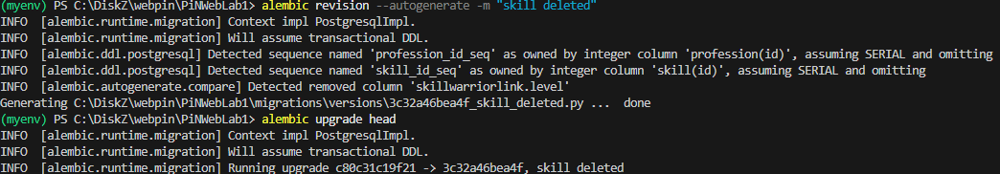
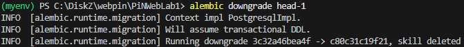
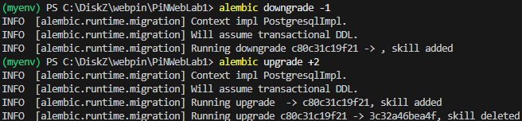
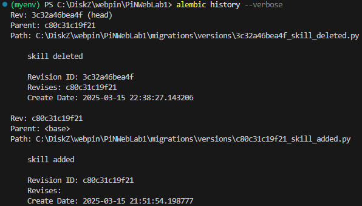
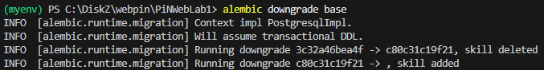

# PiNWebLab1

## Практика 3

В этот раз задание можно реализовать только одним способом, так что я именно этим способом
и реализовал.

Чтобы протестить, что я справился с передачей `DB_ADMIN`, решил удалить строку с уровнем.

Вот и сама ревизия с удалением:

Ура, все отработало, как надо, и я вернул строку с уровнем обратно.

Теперь же я решил поиграться с ревизиями:

- Сначала я узнал, что можно перемещаться по ревизиям относительно какой-то определенной
ревизии:

- Оказывается, head можно не писать, так как она используется по
умолчанию:

- Очень полезная команда `alembic history`, которая показывает дерево ревизий, также может
показывать и срезы (опция `-r`):

- Начало дерево `base`:

